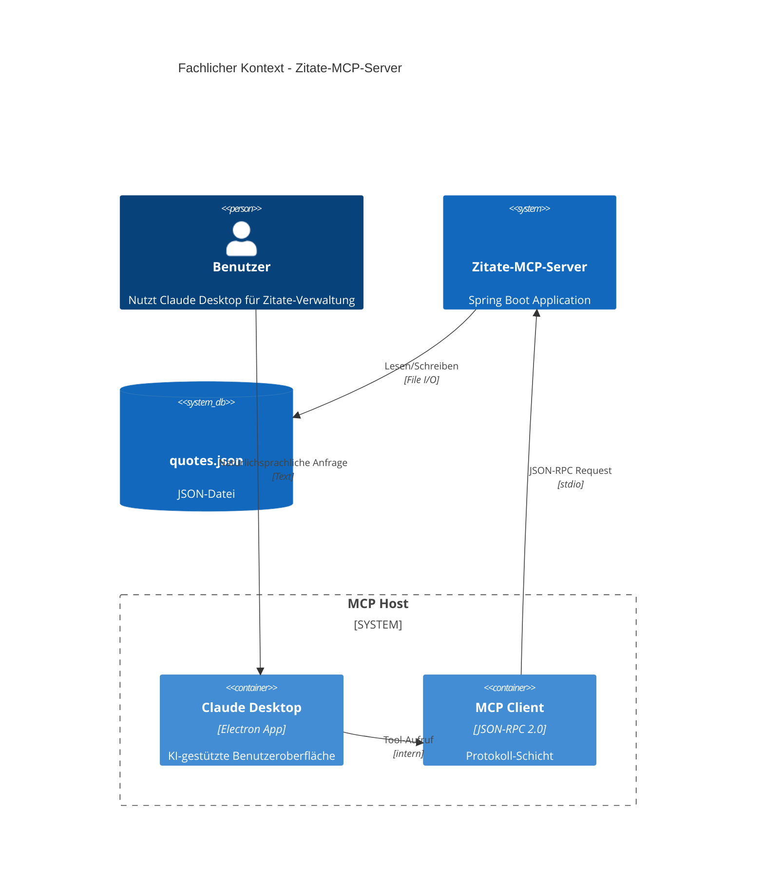
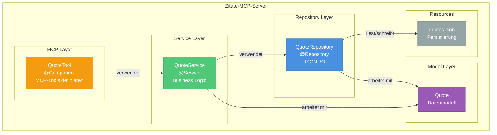
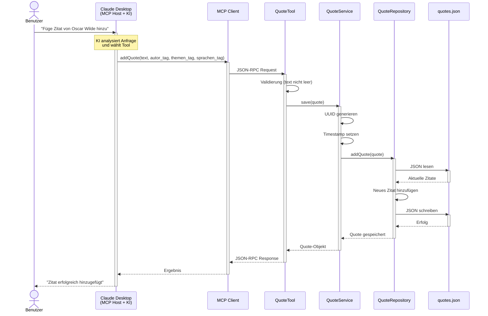
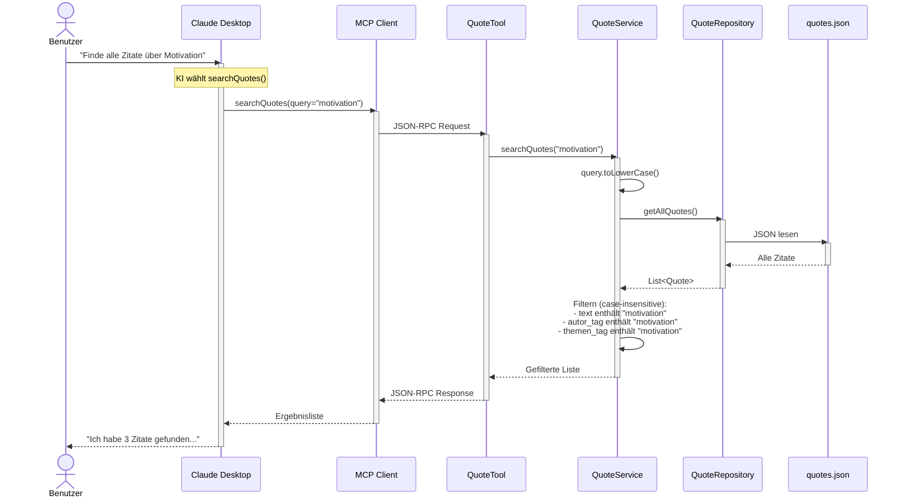
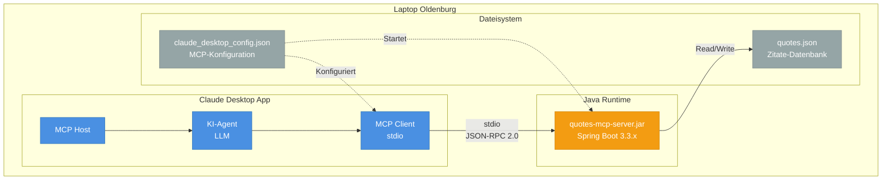
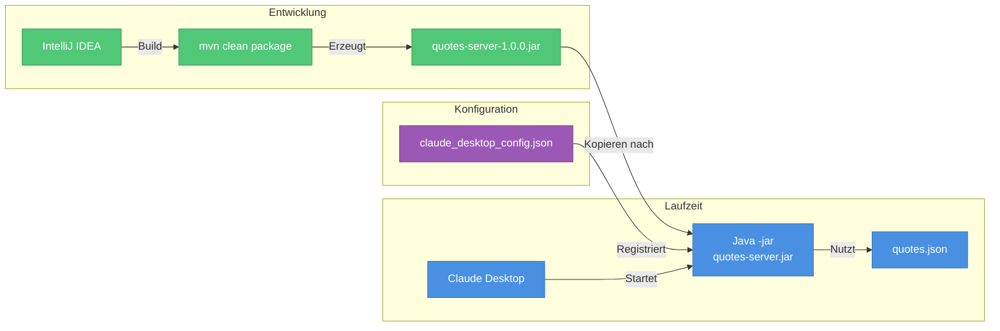
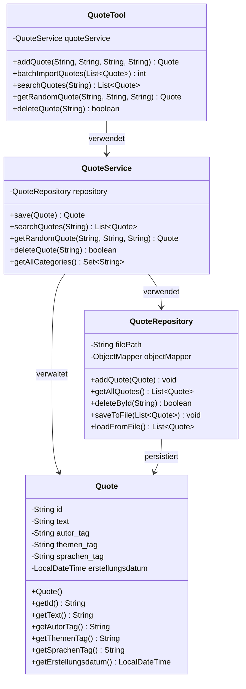

# arc42 Architekturdokumentation
## Zitate-MCP-Server

**Version:** 1.0  
**Datum:** 01.05.2026  
**Autor:** larlibu  
**Status:** Entwurf  
**Projekt:** Persönliche Zitate-Sammlung mit MCP-Server

---

## Inhaltsverzeichnis

1. [Einführung und Ziele](#1-einführung-und-ziele)
2. [Randbedingungen](#2-randbedingungen)
3. [Kontextabgrenzung](#3-kontextabgrenzung)
4. [Lösungsstrategie](#4-lösungsstrategie)
5. [Bausteinsicht](#5-bausteinsicht)
6. [Laufzeitsicht](#6-laufzeitsicht)
7. [Verteilungssicht](#7-verteilungssicht)
8. [Querschnittliche Konzepte](#8-querschnittliche-konzepte)
9. [Architekturentscheidungen](#9-architekturentscheidungen)
10. [Qualitätsanforderungen](#10-qualitätsanforderungen)
11. [Risiken und technische Schulden](#11-risiken-und-technische-schulden)
12. [Glossar](#12-glossar)

---

## 1. Einführung und Ziele

### 1.1 Aufgabenstellung

Entwicklung eines **MCP-Servers** (Model Context Protocol) zur Verwaltung einer persönlichen Zitate-Sammlung. Der Server ermöglicht:

- ✅ Sammeln inspirierender Zitate mit strukturierter Kategorisierung
- ✅ Case-insensitive Suche über Text und Tags
- ✅ Zufälliges Abrufen von Zitaten (gefiltert oder ungefiltert)
- ✅ Batch-Import mehrerer Zitate
- ✅ Integration mit KI-Assistenten (Claude Desktop) via natürlichsprachlicher Anfragen

### 1.2 Qualitätsziele

| Priorität | Qualitätsmerkmal | Konkrete Szenarien |
|-----------|------------------|-------------------|
| 1 | **Robustheit** | Case-insensitive Suche funktioniert zuverlässig; Fehlerbehandlung bei ungültigen Eingaben (leere Texte, fehlende IDs) |
| 2 | **Wartbarkeit** | Klare Schichtentrennung (Model, Service, Repository, Tools); Einfache Erweiterung um neue Tag-Typen |
| 3 | **Datenpersistenz** | JSON-Datei wird atomar geschrieben; Kein Datenverlust bei concurrent writes |
| 4 | **Usability** | Natürlichsprachliche Anfragen via Claude Desktop ohne Kenntnis der technischen API |
| 5 | **Performance** | Antwortzeit < 100ms für Suche bei bis zu 1.000 Zitaten |

### 1.3 Stakeholder

| Rolle | Kontakt | Erwartungshaltung |
|-------|---------|-------------------|
| **Entwickler** | larlibu | Lernprojekt für MCP-Architektur; Spring Boot Best Practices anwenden; arc42-Dokumentation üben |
| **Endnutzer** | larlibu | Einfache Verwaltung persönlicher Zitate ohne technische Komplexität; Schneller Zugriff via Claude Desktop |

---

## 2. Randbedingungen

### 2.1 Technische Randbedingungen

| Randbedingung | Beschreibung | Begründung |
|---------------|--------------|------------|
| **Programmiersprache** | Java 21 | Nutzt vorhandene Expertise; LTS-Version |
| **Framework** | Spring Boot 3.3.x | Standard für Enterprise Java; Dependency Injection; MCP-Integration |
| **Build-Tool** | Maven | Gewohnt; stabile Abhängigkeitsverwaltung |
| **MCP-Integration** | Spring AI MCP Server Starter | Offizielle Spring-Integration für MCP |
| **Persistierung** | JSON-Datei (kein RDBMS) | Requirement aus Aufgabenstellung; einfach, human-readable |
| **Transport** | stdio (Standard I/O) | Lokale Integration mit Claude Desktop; keine HTTP-Infrastruktur nötig |
| **JSON-Serialisierung** | Jackson (Spring Default) | Standard in Spring Boot; robust |

### 2.2 Organisatorische Randbedingungen

| Randbedingung | Beschreibung |
|---------------|--------------|
| **Team** | Einzelprojekt, keine Kollaboration |
| **Entwicklungszeit** | Prototyp innerhalb 1-2 Wochen |
| **Deployment** | Lokal auf eigenem Laptop (Oldenburg, Deutschland) |
| **Lizenz** | Privates Projekt, keine Open-Source-Anforderung |
| **Versionskontrolle** | Git (empfohlen für Lernzwecke) |

### 2.3 Konventionen

- **Code-Style**: Google Java Style Guide
- **Dokumentation**: arc42-Template (dieses Dokument)
- **Diagramme**: Mermaid (integriert in Markdown)
- **Naming**: Deutsch für fachliche Begriffe (autor_tag, themen_tag), English für technische Komponenten (Service, Repository)

---

## 3. Kontextabgrenzung

### 3.1 Fachlicher Kontext

**Übersicht**: Der Zitate-MCP-Server ist eine lokale Anwendung, die über Claude Desktop gesteuert wird.



### 3.2 Technischer Kontext

**Externe Schnittstellen**:

| Schnittstelle | Typ | Beschreibung | Format |
|---------------|-----|--------------|--------|
| **MCP Client (stdio)** | Eingehend | Claude Desktop kommuniziert via JSON-RPC 2.0 über Standard I/O | JSON-RPC 2.0 |
| **quotes.json** | Ausgehend | Lesen/Schreiben der Zitate-Datenbank | JSON (UTF-8) |

**Protokoll-Details**:

- **Transport**: stdio (Standard Input/Output)
- **Protokoll**: JSON-RPC 2.0
- **Encoding**: UTF-8
- **Session**: Stateful (eine Verbindung pro Claude Desktop-Instanz)

---

## 4. Lösungsstrategie

### 4.1 Architekturmuster

| Muster | Anwendung | Begründung |
|--------|-----------|------------|
| **MVC-Pattern** | Model (Quote), Service (QuoteService), Tools (MCP-Schnittstelle) | Bewährtes Pattern; klare Verantwortlichkeiten |
| **Dependency Injection** | Spring Container verwaltet Beans | Lose Kopplung; einfaches Testen |
| **Repository Pattern** | QuoteRepository abstrahiert JSON-Zugriff | Trennung Geschäftslogik / Persistierung |
| **Layered Architecture** | Tools → Service → Repository → Model | Klare Schichtenarchitektur |

### 4.2 Technologieentscheidungen

| Technologie | Entscheidung | Alternativen | Begründung |
|-------------|--------------|--------------|------------|
| **Sprache** | Java 21 | Python, TypeScript | Vorhandene Expertise; typsicher |
| **Framework** | Spring Boot 3.3.x | Micronaut, Quarkus | Umfangreiches Ökosystem; MCP-Support |
| **Persistierung** | JSON-Datei | SQLite, H2 Database | Requirement; einfach; human-readable |
| **Transport** | stdio | HTTP/SSE | Lokal; schnell; sicher; keine Netzwerk-Infrastruktur |
| **Build** | Maven | Gradle | Gewohnt; konservativ; stabil |
| **Testing** | JUnit 5 + Mockito | - | Standard in Spring Boot |

### 4.3 Erfüllung der Qualitätsziele

| Qualitätsziel | Maßnahme |
|---------------|----------|
| **Robustheit** | Input-Validierung in Tools; Exception-Handling; Case-insensitive String-Vergleiche mit `toLowerCase()` |
| **Wartbarkeit** | Klare Schichten; Single Responsibility Principle; Sprechende Namen |
| **Datenpersistenz** | Atomic File Writes; Backup vor Überschreiben; UTF-8 Encoding explizit |
| **Usability** | Aussagekräftige Tool-Descriptions für KI; Natürlichsprachliche Parameter |
| **Performance** | In-Memory-Filtering; Lazy Loading für große Dateien (später) |

---

## 5. Bausteinsicht

### 5.1 Whitebox Gesamtsystem

**Projektstruktur**:

```
quotes-mcp-server/
├── src/
│   ├── main/
│   │   ├── java/
│   │   │   └── de/larlibu/quotes/
│   │   │       ├── QuotesApplication.java
│   │   │       ├── model/
│   │   │       │   └── Quote.java
│   │   │       ├── repository/
│   │   │       │   └── QuoteRepository.java
│   │   │       ├── service/
│   │   │       │   └── QuoteService.java
│   │   │       └── tools/
│   │   │           └── QuoteTool.java
│   │   └── resources/
│   │       ├── application.yml
│   │       └── data/
│   │           └── quotes.json
│   └── test/
│       └── java/
│           └── de/larlibu/quotes/
│               ├── service/
│               │   └── QuoteServiceTest.java
│               └── repository/
│                   └── QuoteRepositoryTest.java
└── pom.xml
```

**Komponentendiagramm**:



### 5.2 Baustein-Beschreibungen

#### QuoteTool (MCP Layer)

**Verantwortung**: Öffentliche MCP-Schnittstelle; definiert Tools für KI-Agenten

**Schnittstelle**:

| Tool | Parameter | Rückgabe | Beschreibung |
|------|-----------|----------|--------------|
| `addQuote` | text, autor_tag, themen_tag, sprachen_tag | Quote | Einzelnes Zitat hinzufügen |
| `batchImportQuotes` | List<Quote> | int | Mehrere Zitate importieren |
| `searchQuotes` | query | List<Quote> | Case-insensitive Suche |
| `getRandomQuote` | autor_tag, themen_tag, sprachen_tag (optional) | Quote | Zufälliges Zitat |
| `deleteQuote` | id | boolean | Zitat löschen |

**Qualität/Leistungsmerkmale**:
- Input-Validierung (nicht-leere Strings)
- Exception-Handling mit aussagekräftigen Meldungen
- Logging aller Tool-Aufrufe

#### QuoteService (Service Layer)

**Verantwortung**: Geschäftslogik; UUID-Generierung; Timestamp-Verwaltung; Filterlogik

**Schnittstelle**:
- `save(Quote quote)`: Speichert Zitat mit generierter ID und Timestamp
- `searchQuotes(String query)`: Case-insensitive Suche über alle Felder
- `getRandomQuote(filters...)`: Zufallsauswahl mit optionalen Filtern
- `deleteQuote(String id)`: Entfernt Zitat
- `getAllCategories()`: Extrahiert alle eindeutigen Themen-Tags

#### QuoteRepository (Repository Layer)

**Verantwortung**: Persistierung; JSON-Serialisierung/Deserialisierung; Datei-I/O

**Schnittstelle**:
- `addQuote(Quote quote)`: Fügt Zitat zur Liste hinzu und speichert
- `getAllQuotes()`: Lädt alle Zitate aus JSON
- `deleteById(String id)`: Entfernt Zitat aus Liste
- `saveToFile(List<Quote> quotes)`: Schreibt Liste in JSON (atomic)
- `loadFromFile()`: Liest JSON und deserialisiert

**Qualität/Leistungsmerkmale**:
- Atomic File Writes (temp file + rename)
- UTF-8 Encoding explizit
- Exception-Handling bei I/O-Fehlern

#### Quote (Model)

**Verantwortung**: Datenmodell; Immutability (idealerweise)

**Attribute**:
```java
{
  "id": "uuid",
  "text": "Zitat-Text",
  "autor_tag": "Autor-Name",
  "themen_tag": "Thema",
  "sprachen_tag": "de|en|...",
  "erstellungsdatum": "ISO-8601"
}
```

---

## 6. Laufzeitsicht

### 6.1 Laufzeitszenario: Zitat hinzufügen

**Trigger**: Benutzer sagt zu Claude: *"Füge ein Zitat von Oscar Wilde hinzu: 'Be yourself; everyone else is already taken.'"*



### 6.2 Laufzeitszenario: Suche

**Trigger**: Benutzer fragt: *"Finde alle Zitate über Motivation"*



---

## 7. Verteilungssicht

### 7.1 Infrastruktur Ebene 1

**Deployment auf lokalem Laptop**:



**Komponenten**:

| Komponente | Technologie | Beschreibung |
|------------|-------------|--------------|
| **Claude Desktop** | Electron App | MCP Host; startet Server-Prozess |
| **MCP Client** | JSON-RPC 2.0 | Eingebettet in Claude Desktop |
| **quotes-mcp-server.jar** | Spring Boot 3.3.x | Standalone JAR; Java 21 Runtime |
| **quotes.json** | JSON-Datei | UTF-8; ca. 10-100 KB (je nach Anzahl Zitate) |
| **Config** | JSON | `~/Library/Application Support/Claude/claude_desktop_config.json` (macOS) |

### 7.2 Deployment-Prozess



**Deployment-Schritte**:

1. **Build**: `mvn clean package` → erzeugt `target/quotes-server-1.0.0.jar`
2. **Konfiguration**: Editiere `claude_desktop_config.json`:
   ```json
   {
     "mcpServers": {
       "quotes-server": {
         "command": "java",
         "args": ["-jar", "/pfad/zu/quotes-server-1.0.0.jar"]
       }
     }
   }
   ```
3. **Start**: Claude Desktop neu starten → Server wird automatisch geladen
4. **Test**: Natürlichsprachliche Anfrage stellen

---

## 8. Querschnittliche Konzepte

### 8.1 Datenmodell

**Quote-Struktur**:

```json
{
  "id": "550e8400-e29b-41d4-a716-446655440000",
  "text": "Be yourself; everyone else is already taken.",
  "autor_tag": "Oscar Wilde",
  "themen_tag": "Authentizität",
  "sprachen_tag": "englisch",
  "erstellungsdatum": "2026-05-01T18:01:23.456Z"
}
```

**Klassendiagramm**:



### 8.2 Fehlerbehandlung

**Strategie**: Exceptions mit aussagekräftigen Meldungen an KI durchreichen

**Beispiel**:
```java
@Tool(description = "Füge ein neues Zitat hinzu")
public Quote addQuote(
    @ToolParam(description = "Text des Zitats") String text,
    @ToolParam(description = "Autor") String autor_tag,
    @ToolParam(description = "Thema") String themen_tag,
    @ToolParam(description = "Sprache") String sprachen_tag
) {
    if (text == null || text.isBlank()) {
        throw new IllegalArgumentException("Zitat-Text darf nicht leer sein");
    }
    if (autor_tag == null || autor_tag.isBlank()) {
        throw new IllegalArgumentException("Autor-Tag ist erforderlich");
    }
    return quoteService.save(new Quote(text, autor_tag, themen_tag, sprachen_tag));
}
```

**Fehlertypen**:

| Fehlertyp | Exception | Behandlung |
|-----------|-----------|------------|
| **Validation** | IllegalArgumentException | Klare Meldung an KI; keine Persistierung |
| **I/O** | IOException | Logging; User-freundliche Meldung |
| **JSON Parsing** | JsonProcessingException | Backup laden; User informieren |
| **Not Found** | NoSuchElementException | Leere Liste oder null zurückgeben |

### 8.3 Logging

**Framework**: SLF4J + Logback (Spring Boot Default)

**Log-Levels**:
- **INFO**: Tool-Aufrufe, erfolgreiche Operationen
- **WARN**: Fehlgeschlagene Suchen (keine Ergebnisse)
- **ERROR**: I/O-Fehler, Parsing-Fehler

**Beispiel**:
```java
log.info("Tool addQuote aufgerufen: autor={}, thema={}", autor_tag, themen_tag);
log.error("Fehler beim Speichern der quotes.json: {}", e.getMessage());
```

### 8.4 Sicherheit

**Lokal = Hohe Sicherheit**:
- ✅ Keine Netzwerk-Exposition
- ✅ Daten bleiben auf lokalem Dateisystem
- ✅ Keine Authentifizierung nötig

**Best Practices**:
- Input-Validierung gegen Injection (auch wenn lokal)
- UTF-8 Encoding explizit setzen
- Keine sensiblen Daten in Logs

### 8.5 Performance

**Optimierungen**:

| Bereich | Maßnahme | Erwartete Verbesserung |
|---------|----------|------------------------|
| **Suche** | In-Memory-Filtering (keine DB) | < 10ms für 1.000 Zitate |
| **JSON-Parsing** | Jackson (optimiert) | < 20ms für 100 KB Datei |
| **Caching** | Optional: Zitate in-memory halten | 99% schneller bei wiederholten Suchen |

**Limits**:
- Maximale Anzahl Zitate: ~10.000 (danach Migration zu DB empfohlen)
- Maximale Zitat-Länge: 5.000 Zeichen

---

## 9. Architekturentscheidungen

### ADR-001: JSON-Datei statt Datenbank

**Status**: Akzeptiert  
**Kontext**: Persistierung der Zitate-Sammlung  
**Entscheidung**: JSON-Datei verwenden, keine relationale Datenbank  
**Begründung**:
- Requirement aus Aufgabenstellung
- Einfacher Setup (keine DB-Installation)
- Human-readable (einfaches Backup/Restore)
- Ausreichend für < 10.000 Zitate

**Konsequenzen**:
- ✅ Schnelle Entwicklung
- ✅ Einfaches Debugging
- ❌ Keine Transaktionen
- ❌ Performance-Limit bei großen Datenmengen
- **Migration zu DB nötig bei > 10.000 Zitaten**

---

### ADR-002: stdio statt HTTP/SSE

**Status**: Akzeptiert  
**Kontext**: Transport-Mechanismus für MCP-Server  
**Entscheidung**: stdio (Standard Input/Output) verwenden  
**Begründung**:
- Lokale Nutzung mit Claude Desktop
- Schneller (keine Netzwerk-Latenz)
- Sicherer (keine Netzwerk-Exposition)
- Einfacher (kein HTTP-Server nötig)

**Konsequenzen**:
- ✅ < 5ms Latenz
- ✅ Keine Firewall-Konfiguration
- ❌ Nur ein Benutzer gleichzeitig
- ❌ Keine Remote-Nutzung möglich
- **Später HTTP/SSE hinzufügen für ChatGPT-Integration**

---

### ADR-003: Spring Boot statt Vanilla Java

**Status**: Akzeptiert  
**Kontext**: Framework-Wahl für MCP-Server  
**Entscheidung**: Spring Boot 3.3.x verwenden  
**Begründung**:
- Nutzt vorhandene Expertise (larlibu)
- Dependency Injection (sauberer Code)
- Spring AI MCP Server Starter verfügbar
- Robustes Ökosystem

**Konsequenzen**:
- ✅ Schnellere Entwicklung
- ✅ Testbarkeit (Mockito, Spring Test)
- ❌ Overhead (~50 MB JAR)
- ❌ Längere Startup-Zeit (~2-3 Sekunden)

---

### ADR-004: Exceptions statt leere Ergebnisse

**Status**: Akzeptiert  
**Kontext**: Fehlerbehandlung in MCP-Tools  
**Entscheidung**: Aussagekräftige Exceptions werfen statt leere Listen zurückzugeben  
**Begründung**:
- KI kann Fehlermeldungen besser interpretieren
- User bekommt klares Feedback
- Besseres Debugging

**Konsequenzen**:
- ✅ Klare Fehlermeldungen
- ✅ User weiß, was schiefging
- ❌ Etwas mehr Code (try-catch)

---

## 10. Qualitätsanforderungen

### 10.1 Qualitätsbaum

```
Qualität
├── Funktionale Eignung
│   ├── Funktionale Vollständigkeit: Alle 5 Tools implementiert
│   └── Funktionale Korrektheit: Case-insensitive Suche funktioniert
├── Zuverlässigkeit
│   ├── Fehlertoleranz: Robuste Exception-Handling
│   └── Wiederherstellbarkeit: JSON-Backup bei Fehler
├── Benutzbarkeit
│   ├── Erlernbarkeit: Natürlichsprachliche API
│   └── Bedienbarkeit: Integration in Claude Desktop
├── Effizienz
│   ├── Zeitverhalten: < 100ms Antwortzeit
│   └── Ressourcennutzung: < 200 MB RAM
├── Wartbarkeit
│   ├── Modularität: Klare Schichten (Model, Service, Repository, Tools)
│   ├── Wiederverwendbarkeit: Generisches Repository-Pattern
│   └── Testbarkeit: Unit-Tests für Service + Repository
└── Übertragbarkeit
    ├── Anpassbarkeit: Einfache Erweiterung um neue Tags
    └── Installierbarkeit: Standalone JAR

```

### 10.2 Qualitätsszenarien

| ID | Qualitätsmerkmal | Szenario | Messung |
|----|------------------|----------|---------|
| QS-1 | **Robustheit** | User gibt leeren Text ein → System gibt klare Fehlermeldung | Manueller Test; Exception-Meldung prüfen |
| QS-2 | **Performance** | Suche in 1.000 Zitaten | < 100ms Antwortzeit (via Logging) |
| QS-3 | **Wartbarkeit** | Neuer Tag-Typ "quellen_tag" hinzufügen | < 30 Min Entwicklungszeit |
| QS-4 | **Usability** | User findet Zitat ohne technische Kenntnisse | Natürlichsprachliche Anfrage erfolgreich |
| QS-5 | **Zuverlässigkeit** | JSON-Datei korrupt → System lädt Backup | Automatische Wiederherstellung |

---

## 11. Risiken und technische Schulden

### 11.1 Risiken

| ID | Risiko | Wahrscheinlichkeit | Auswirkung | Maßnahme |
|----|--------|-------------------|------------|----------|
| R-1 | **JSON-Datei korrupt** | Mittel (20%) | Hoch (Datenverlust) | Automatisches Backup vor jedem Schreibvorgang; Validation beim Laden |
| R-2 | **Encoding-Probleme** (UTF-8) | Niedrig (5%) | Mittel (Umlaute falsch) | Explizit UTF-8 in Jackson setzen; Tests mit Umlauten |
| R-3 | **Performance bei > 10.000 Zitaten** | Niedrig (10%) | Mittel (langsame Suche) | Monitoring; ab 5.000 Zitaten Migration zu SQLite planen |
| R-4 | **Concurrent Writes** | Sehr niedrig (1%) | Hoch (Race Condition) | Aktuell: Nur ein User; Später: File Locking implementieren |
| R-5 | **Spring Boot Overhead** | Niedrig | Niedrig (2-3s Start) | Akzeptabel für lokale Nutzung; später GraalVM Native Image |

### 11.2 Technische Schulden

| ID | Beschreibung | Priorität | Refactoring-Plan |
|----|--------------|-----------|------------------|
| TD-1 | **Kein Caching** (Zitate werden bei jeder Suche neu geladen) | Niedrig | In-Memory-Cache in QuoteRepository |
| TD-2 | **Keine Versionierung** der JSON-Struktur | Mittel | Schema-Version in JSON; Migration-Logik |
| TD-3 | **Kein Backup-Mechanismus** | Hoch | Automatisches Backup vor Schreibvorgang |
| TD-4 | **Keine Unit-Tests** (initial) | Hoch | JUnit 5 Tests für Service + Repository |
| TD-5 | **Hardcoded File Path** | Niedrig | Konfigurierbar via `application.yml` |

---

## 12. Glossar

| Begriff | Definition |
|---------|------------|
| **MCP** | Model Context Protocol - Standard für KI-Agent-Integration |
| **MCP Host** | Anwendung, die einen MCP Client enthält (z.B. Claude Desktop) |
| **MCP Client** | Protokoll-Schicht, die JSON-RPC 2.0 spricht |
| **MCP Server** | Backend, das Tools und Ressourcen für KI bereitstellt |
| **Tool** | Aufrufbare Funktion, die ein MCP-Server bereitstellt (via `@Tool`) |
| **stdio** | Standard Input/Output - lokaler Transport-Mechanismus |
| **JSON-RPC 2.0** | Remote Procedure Call-Protokoll über JSON |
| **Quote** | Datenmodell für ein Zitat mit Text, Tags und Metadaten |
| **autor_tag** | Kategorisierung nach Autor (z.B. "Oscar Wilde") |
| **themen_tag** | Kategorisierung nach Thema (z.B. "Motivation") |
| **sprachen_tag** | Kategorisierung nach Sprache (z.B. "deutsch", "englisch") |
| **Case-insensitive** | Groß-/Kleinschreibung wird ignoriert (via `toLowerCase()`) |
| **Batch-Import** | Import mehrerer Zitate auf einmal |
| **Jackson** | Java-Library für JSON-Serialisierung (Standard in Spring Boot) |
| **arc42** | Template für Software-Architekturdokumentation |

---

## Anhang A: Referenzen

- **Spring AI MCP Documentation**: https://docs.spring.io/spring-ai/reference/api/mcp/
- **Model Context Protocol Spec**: https://modelcontextprotocol.io
- **arc42 Template**: https://arc42.org
- **Claude Desktop**: https://claude.ai/download
- **Mermaid Diagrams**: https://mermaid.js.org

---

## Anhang B: Änderungshistorie

| Version | Datum | Autor | Änderung |
|---------|-------|-------|----------|
| 1.0 | 01.05.2026 | larlibu | Initiale Version |

---

**Ende der Architekturdokumentation**
